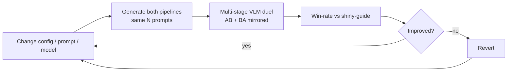

# my-agent Quality Improvement Plan

Concrete plan to make `my-agent` generate higher-quality Three.js that beats the current leader in duels, while staying within miner requirements (validator-safe output, reproducible Docker, open-source models in production).

Read alongside [PIPELINE_WORKFLOW.md](PIPELINE_WORKFLOW.md).

---

## 0. Miner requirements this plan must respect

| Requirement | Constraint |
|-------------|-----------|
| Output contract | `export default function generate(THREE)`, synchronous, no imports, fits in `[-0.5,0.5]^3`, Y-up/+Z |
| Hard limits | <= 250k verts, <= 200 draw calls, <= 5s exec, <= 1MB file, <= 50KB literals |
| Reproducibility | Public repo + commit + `docker/Dockerfile` on `:10006`; audit reruns 128 prompts, same seed |
| Models (production) | Commercial-use open-source only (Qwen / GLM), pinned versions |
| Scoring | Quality matters, speed does not (as long as the deadline is met) |

OpenRouter frontier models are used only for CPU R&D; the shipped Docker miner must use the GPU vLLM config with open-source models.

---

## 1. Changes already applied in this branch

### 1a. Turn on dormant quality levers

CPU profile (`local-eval/configuration.my-agent.cpu-openrouter.yaml`):

- `refinement_enabled: true`
- `event_bus.score_threshold: 0.55`, `max_iter: 3`
- `coder.ensemble_size: 3` with `workers: 1` (best-of-3 sequentially on weak boxes)
- Planner fully configured and one flag (`use_planner: true`) away from an A/B.

Shipped GPU `configuration.yaml`:

- `refinement_enabled: true` (was false — biggest dormant lever)
- `max_iter: 3`

### 1b. Prompt improvements (duel-driven, after 5–5 vs shiny-guide)

Loss cluster from `local-eval/runs/duel/duel_detailed.md` (10 prompts): broken
geometry, missing landmarks (handle/spout/brim/hole/fold/binding), floating
parts, collapsed 3D depth. Applied:

- `modules/scene_coder/prompts.py`: **Duel-winning construction rules** +
  landmark inventory + Lathe-for-vessels + thin-sheet folds + structural
  coherence repair playbook (simplify broken meshes before adding detail).
- `modules/critic/prompts.py`: structural high-severity list for all classes;
  score capped ≤0.45 while structural issues remain; color called out for
  close duels.
- Earlier: multi-view/duel awareness, critic score calibration, planner quality bar.

### 1c. Structured image analysis → detailed 3D build

- Planner OSD schema adds `primitive`, `attach_to`, `size_frac`, `color_hex`,
  `material` per part; planner prompt requires landmark checklist + build order.
- Coder system prompt: **Structured image → 3D build protocol** (analyze →
  shared dims → body → landmarks → trim).
- Image-only + OSD user templates force that structure in emitted JS.
- CPU profile: `use_planner: true` so generation runs analyze(OSD) → code.

---

## 2. Better VLM models (config-driven sweep)

Every `actors.*.model` in the CPU profile is a knob. The duel harness (Section 3) measures the effect of changing one.

### How to sweep without breaking the duel's fairness

- To measure **pipeline + prompt** improvements: keep `coder.model` identical to the shiny-guide opponent (`google/gemini-2.5-pro-preview`). Any win is attributable to pipeline/prompt changes.
- To measure **model** improvements: change only `coder.model` (or `critic.model`) and re-run the duel; compare win-rate deltas.

### Candidate models

| Role | Candidate | Notes |
|------|-----------|-------|
| Coder (R&D) | `google/gemini-2.5-pro-preview` | Baseline; matches opponent |
| Coder (R&D) | `anthropic/claude-sonnet-4` | Strong spatial decomposition |
| Coder (R&D) | `openai/gpt-5.1` | Strong multimodal code generation |
| Coder (production) | `qwen/qwen3-vl-235b-instruct` or the shipped `Tooony133/Qwen-3.6-27B-AstroWolf` | Open-weight, commercial-use OK |
| Critic/Judge | separate from coder model | A different model gives less self-favoring critiques |
| Critic/Judge (production) | `zai-org/GLM-4.6V-Flash` | Shipped choice; matches subnet judge family |

### Procedure

1. Establish a baseline duel win-rate with the default profile (Section 3).
2. Change one model id, re-run `./local-eval/run-duel.sh pool --limit N`.
3. Keep the change only if win-rate improves beyond noise (see N guidance in the duel README).
4. For any model kept for production, confirm it is available as open-source in the GPU `configuration.yaml` and pin its revision.

---

## 3. Duel-driven evaluation loop

Use the A/B duel harness ([local-eval/README.md](../../local-eval/README.md), `run-duel.sh` + `scripts/duel_pipelines.py`) to make every change measurable:

Target: my-agent win-rate > 50% vs shiny-guide on a representative prompt set, then port the winning config/prompts to the GPU `configuration.yaml`.

---

## 4. Offline model training (GRPO)

To improve the image→Three.js coder itself (not just prompts/pipeline knobs), see:

- Strategy: [`docs/TRAINING_GRPO_STRATEGY.md`](../../docs/TRAINING_GRPO_STRATEGY.md)
- **Runnable cookbook:** [`training/COOKBOOK.md`](../training/COOKBOOK.md) (`./run/00_setup.sh` → … → `./run/04_merge_and_eval.sh`)

Summary: SFT warm-start on validator-filtered `(image, js)` pairs from `prompts.txt`, then GRPO with rewards = validate → render → S1/DINO/S4 (+ within-group duels), judge with GLM-4.6V-Flash; ship merged open weights in Docker.

---

## 5. Backlog (higher effort, not yet applied)

| Idea | Rationale |
|------|-----------|
| Increase `ensemble_size` on GPU beyond 40 for hard categories | More bracket candidates -> better front match |
| Category-conditioned coder prompt (detect object class first, inject only the relevant handbook) | Shorter, more focused context per prompt |
| Add a second critic pass focused only on side/back views | Aligns with judge side-guard stage |
| Cache/reuse planner OSD across ensemble members | Consistent decomposition, lower cost |
| Per-category `score_threshold` | Spend more repair on historically weak categories |
