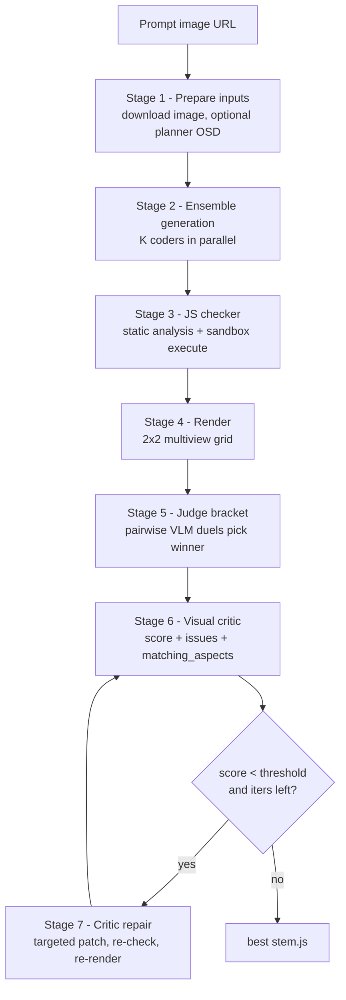

# my-agent Pipeline Workflow: Image Prompt to Three.js

This document describes how `my-agent` turns a single reference image (the competition prompt) into a validator-compatible Three.js module (`export default function generate(THREE)`).

It is a fork of the current subnet leader (`shiny-guide`). The competition is **404-GEN Subnet 17, Competition 2: Procedural Image-to-3D**. Miners submit `{stem}.js` files; validators render them and run pairwise VLM duels to rank miners.

> To run this pipeline **live** on the subnet (build/run the Docker, reveal on-chain, generate a round, upload to your CDN, pass the audit), see [`GO_LIVE.md`](GO_LIVE.md).
>
> How validators score `.js` files (S1–S4 duels) and where prompt/eval images come from: [`../../docs/VALIDATOR_SCORING_AND_DATASET.md`](../../docs/VALIDATOR_SCORING_AND_DATASET.md).

---

## 1. Big picture

Key rule: the generated module **cannot see the image at execution time**. The validator sandbox calls `generate(THREE)` with only the `THREE` library. All information from the image must be baked into the code **at generation time** by the VLM + coder. That is the entire job of this pipeline.

---

## 2. Runtime modes

The pipeline behaves differently based on three config switches in `configuration.yaml`:

| Switch | Effect when true | Effect when false |
|--------|------------------|-------------------|
| `pipeline.use_planner` | Runs a VLM planner first to produce a structured OSD brief, then the coder works from OSD (+ optional image) | Coder consumes the image directly (requires `coder.multimodal: true`) |
| `actors.coder.ensemble_size > 1` | Stage 2 fans out K coders; Stage 5 judge bracket picks the best | Single coder pass, no judge bracket |
| `pipeline.refinement_enabled` | Runs Stage 6 critic + Stage 7 repair loop up to `max_iter` | Stops after the iteration-0 winner; no critic, no repair |

### Shipped GPU config (`my-agent/configuration.yaml`)

- `use_planner: false`, `refinement_enabled: false`, `ensemble_size: 40`
- So the shipped flow is: image -> 40 coders -> checker -> render -> judge bracket -> best JS. **Critic and repair are OFF.**
- Models: `Tooony133/Qwen-3.6-27B-AstroWolf` (coder), `zai-org/GLM-4.6V-Flash` (critic/judge), DINOv3 embedder.

### CPU dev config (`local-eval/configuration.my-agent.cpu-openrouter.yaml`)

- Runs on the dev box via OpenRouter (no GPU). `ensemble_size: 3`, `refinement_enabled: true` so the full quality path (critic + repair) is exercised. See the [local eval README](../../local-eval/README.md).

The two biggest dormant quality levers in the shipped config are `refinement_enabled` and `use_planner` (both currently off).

---

## 3. Stage-by-stage detail

Code entrypoints:

| Concern | File |
|---------|------|
| FastAPI server + batch API | [pipeline_service/serve.py](../pipeline_service/serve.py) |
| Lifecycle + batch runner | [pipeline_service/pipeline/generation_pipeline.py](../pipeline_service/pipeline/generation_pipeline.py) |
| Agent wiring | [pipeline_service/pipeline/factory.py](../pipeline_service/pipeline/factory.py) |
| Iteration loop | [pipeline_service/pipeline/orchestrator.py](../pipeline_service/pipeline/orchestrator.py) |
| Stage functions | [pipeline_service/pipeline/stages.py](../pipeline_service/pipeline/stages.py) |
| Config schema | [pipeline_service/config/settings.py](../pipeline_service/config/settings.py) |

### Stage 1 - Prepare inputs (`prepare_inputs_stage`)

- Downloads the reference image once (`utils/http.download_image`) into `task.image_bytes`.
- If `use_planner: true`, runs `ScenePlannerAgent.plan()` -> an **OSD** (Object Structural Description): `object_type`, a markdown `scene_brief`, and a `parts[]` list with per-part narratives, count hints, and material cues. Stored as `task.osd`.
- If `use_planner: false`, `task.osd` stays `None` and the coder must be multimodal.

Module: [modules/scene_planner/](../pipeline_service/modules/scene_planner/) (`agent.py`, `prompts.py`).

### Stage 2 - Ensemble generation (`multigen_first_iter`)

- Launches `ensemble_size` (K) coders concurrently, each with a different seed (`task.seed + k`) and `ensemble_temperature`, so candidates diverge.
- Each coder (`SceneCoderAgent.code()`) sends the image (and/or OSD) to the VLM and returns a raw JS module. The system prompt in [modules/scene_coder/prompts.py](../pipeline_service/modules/scene_coder/prompts.py) enforces the output contract, material normalization table, and domain playbooks (vehicles, seating, surface decoration).
- Byte-identical candidates are folded onto their lowest-k leader (`_code_digest`) so the bracket is deterministic and does not waste judge calls.

Highest-ROI stage for duels: more candidates -> the bracket has a better chance of finding a candidate that matches the front view.

### Stage 3 - JS checker (`js_checker.process`)

- Runs each candidate through a Node sandbox ([modules/js_checker/](../pipeline_service/modules/js_checker/)): parse (Babel), static analysis (forbidden APIs, literal budget), sandbox execute `generate(THREE)`, post-validation (bbox, vertices, draw calls, depth, instances, textures).
- Modes: `sanity` (validate only) or `with_object` (also serialize the scene to JSON for faster rendering when `render_from_object: true`).
- A candidate that fails the checker is dropped (`drop_reason = "checker"`). If **all** candidates fail, the task fails at `multigen`.

This is a reliability gate: on the subnet a prompt with no valid file **auto-loses every duel** for that prompt.

### Stage 4 - Render (`renderer` module)

- Renders each surviving candidate to a 2x2 multiview grid PNG via headless Chromium sidecars ([modules/renderer/](../pipeline_service/modules/renderer/)).
- When the judge is active, also renders 8 white-background views + gray front views (`render_judge_views`) used by the judge's best-view and side-guard stages.

### Stage 5 - Judge bracket (`_resolve_bracket`, `JudgeAgent.compare`)

- Pairwise king-of-the-hill bracket over the surviving candidates. Each duel calls the multi-stage judge ([modules/judge/multi_stage.py](../pipeline_service/modules/judge/multi_stage.py)):
  - **S1** front prompt match (AB + BA order mirroring to cancel position bias)
  - **S2** three specialists: DINO best-view compare, 2x2 grid artifact compare, checklist verify
  - **S3** gray rescue (only on draws)
  - **S4** side guard (penalize garbage side views)
- DINO tie-break on draws (`DinoEmbedder`, [modules/judge/dino.py](../pipeline_service/modules/judge/dino.py)).
- The bracket winner is promoted to `task.js_code` / `task.rendered_png`.

This mirrors how the real subnet validator judges miners, so winning the internal bracket correlates with winning real duels.

### Stage 6 - Visual critic (`critic_stage`)

- Only runs when `refinement_enabled: true`.
- Stateless VLM call ([modules/critic/](../pipeline_service/modules/critic/)) comparing reference vs render grid. Returns a `CriticReport`: `overall_score` (0..1), `stop`, `matching_aspects` (preserve-list), and up to 5 `issues` (each with `kind`, `target_node_id`, `severity`, `description`).
- The score drives the stop condition; the issues + preserve-list drive the repair.

### Stage 7 - Critic repair (`code_and_check` with `last_report`)

- `SceneCoderAgent.code_critic_repair()` gets the previous module (in session history), the issues to fix, and the preserve-list, and produces a **targeted patch** (not a full regen).
- Re-runs checker + render + critic. The loop continues until any stop condition:
  - `report.stop` is true, or
  - `overall_score >= score_threshold`, or
  - no issues remain, or
  - `iteration >= max_iter`, or
  - `best_score < 0.20` after iteration 1 (early give-up).
- The best-scoring snapshot across iterations is kept as the final output.

---

## 4. Quality-relevant config knobs

From [configuration.yaml](../configuration.yaml) / [config/settings.py](../pipeline_service/config/settings.py):

| Knob | Where | What it controls |
|------|-------|------------------|
| `pipeline.use_planner` | pipeline | Structured OSD brief before coding |
| `pipeline.refinement_enabled` | pipeline | Critic + repair loop on/off |
| `pipeline.render_from_object` | pipeline | Render from serialized scene JSON (faster) |
| `actors.coder.ensemble_size` | coder | Number of parallel candidates (K) |
| `actors.coder.ensemble_temperature` | coder | Candidate diversity |
| `actors.coder.multimodal` | coder | Coder consumes image directly (required if no planner) |
| `actors.coder.model` | coder | Coder VLM model id |
| `actors.coder.max_tokens` | coder | Room for complex scenes |
| `actors.critic.model` | critic | Critic VLM model id |
| `actors.judge.model` | judge | Judge VLM model id |
| `event_bus.max_iter` | event_bus | Max refinement iterations |
| `event_bus.score_threshold` | event_bus | Critic score that stops refinement early |
| `event_bus.task_deadline_s` | event_bus | Per-task wall-clock budget |
| `embedder.enabled` / `embedder.model_id` | embedder | DINOv3 best-view + tie-break |
| `renderer.sidecar_port` / `renderer.static_port_base` | renderer | Chromium sidecar ports (offset to run two pipelines side by side) |

---

## 5. Where quality is won or lost

| Symptom | Root cause | Lever |
|---------|-----------|-------|
| Prompt produces no file | All candidates fail checker | Bigger ensemble, stronger coder prompt, checker-repair |
| Object recognizable but wrong parts | Weak decomposition | Planner OSD, better coder VLM, ensemble |
| Right parts, wrong proportions/materials | No refinement | `refinement_enabled: true`, tuned critic |
| Empty / tiny render | Missing `fitToUnitCube(0.95/maxDim)` | Coder system prompt (enforced) |
| Near-black metal surfaces | metalness too high (no env map) | Coder system prompt caps metalness <= 0.6 |
| Blank render despite valid JS | Plain arrays passed to Lathe/Tube | Coder system prompt requires `Vector2`/`Vector3` |

See also the miner guide: [docs/MINER_VALIDATOR_GUIDE.md](../../docs/MINER_VALIDATOR_GUIDE.md) section 10.5 (pipeline stages) and the improvement plan in this folder.
